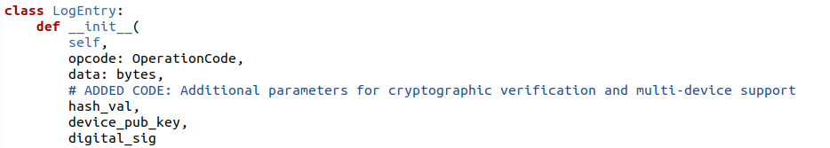
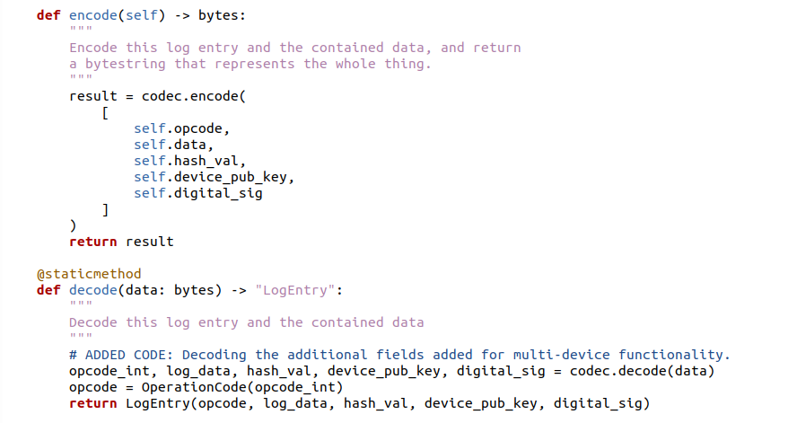
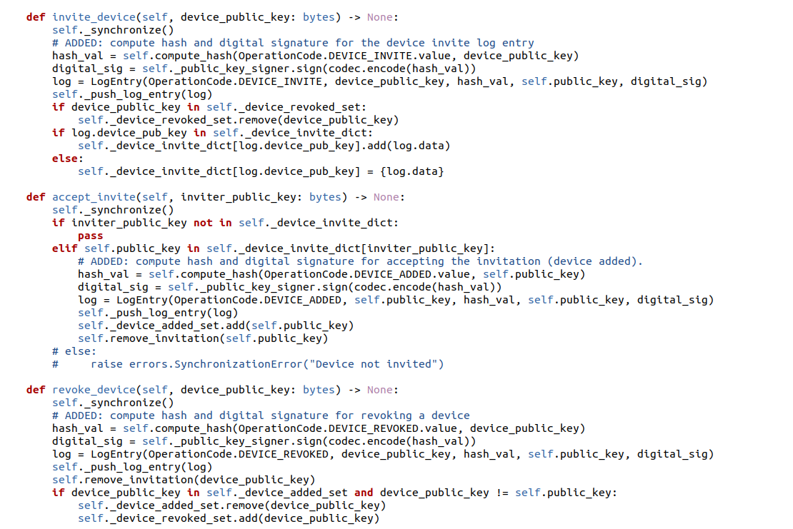
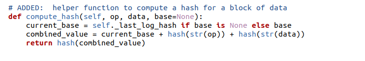
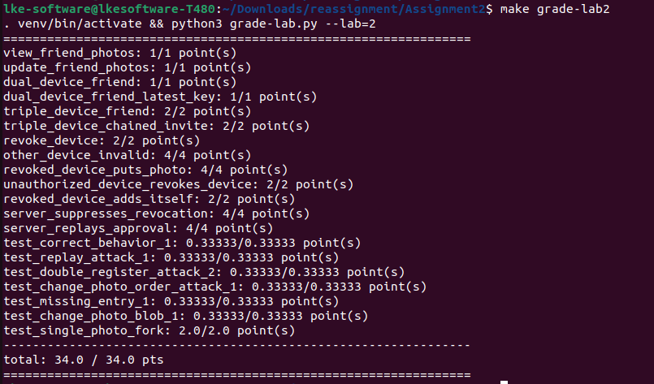

# Assignment Report

## 

## 

## Executive summary

This project extends a basic photo-sharing app by adding support for
multiple devices and friend features. In this assignment, I implemented
new log entry formats that include cryptographic hashes, public keys,
and digital signatures. these changes allow devices to invite, accept,
and revoke each other securely, and they ensure that friends see only
the photos uploaded by authorized devices. this report explains what was
done, how it was implemented, and how the design meets key security
goals.

## Part 1: Implementation report

### 1. Overview of implementation

the project builds on a previous assignment by adding the following key
features:

-   ****Multi-device ****s****upport:**\
    **I added functions to invite a new device, accept an invitation,
    and revoke a device. Each device has its own public key and logs its
    actions using cryptographic signatures.****

```{=html}
<!-- -->
```
-   ****Friend ****f****eatures:****\
    The client now maintains a local friend list that stores trusted
    public keys and photo logs for each friend. This lets users view
    photos uploaded by friends while ensuring the data is authentic.

```{=html}
<!-- -->
```
-   ****e****nhanced ****l****og ****e****ntries:****\
    I updated the log entry structure to include a hash value, the
    device's public key, and a digital signature. These additions help
    verify that every log entry is correct and hasn't been tampered
    with.

{width="6.6929in"
height="1.1965in"}

### 2. Detailed design and implementation

#### a. Log entry structure

the **LogEntry** class was extended to store extra information:

-   ****Operation ****c****ode:**** determines the type of operation
    (REGISTER, PUT_PHOTO, DEVICE_INVITE, DEVICE_ADDED, DEVICE_REVOKED).
-   ****Data:**** encoded information relevant to the operation (for
    example, the photo ID or the public key of an invited device
-   ****Hash ****v****alue (******hash_val******):**** a cryptographic
    hash computed over the operation, ensuring the integrity of the log
    entry
-   ****Device ****p****ublic ****k****ey
    (******device_pub_key******):**** the public key of the device that
    generated the log entry
-   ****Digital ****s****ignature (******digital_sig******):**** a
    signature over the hash value, allowing other devices and the server
    to verify authenticity

these additions make it possible to check that log entries (such as
those for photo uploads or device management) are valid and have not
been modified by an attacker.

{width="6.6929in"
height="3.55in"}

#### 

#### b. Multi-Device management in client

the client was updated to support multi-device operations:

-   ****Device ****i****nvitation :****\
    the **invite_device()** function computes a hash of the invited
    device's public key, signs it, and creates a log entry. This tells
    the server and other devices that an invitation has been sent.

```{=html}
<!-- -->
```
-   ****Device ****a****cceptance :****\
    when a device receives an invitation, it calls **accept_invite()**.
    The device then creates a log entry (DEVICE_ADDED) that proves it
    was invited and accepted the invitation.

```{=html}
<!-- -->
```
-   ****Device ****r****evocation :****\
    the **revoke_device()** function allows a device to remove another
    device's access. Even if a revoked device had uploaded photos before
    it was revoked, those photos remain valid because they were signed
    when the device was still authorized.

{width="6.6929in"
height="4.4681in"}

In addition, local dictionaries and sets are maintained to track:

-   ****i****nvitations ****s****ent :**** Stored in
    **\_device_invite_dict** to manage pending invites
-   ****a****uthorized ****d****evices :**** Tracked using
    **\_device_added_set**
-   ****r****evoked ****d****evices :**** Managed in
    **\_device_revoked_set**

#### c. Helper functions

important helper functions were added and simplified to aid in protocol
verification:

-   ****compute_hash :****\
    this function computes a simple hash over an operation and its data.
    It uses a base hash (either the last log hash or a friend-specific
    hash) and combines it with the operation and data

    {width="6.3972in"
    height="1.0772in"}

```{=html}
<!-- -->
```
-   ****check_signature :****\
    this function checks that a log entry's digital signature matches
    the computed hash and that the device is allowed to perform the
    operation.

```{=html}
<!-- -->
```
-   ****remove_invitation:****\
    a helper function that removes a device from the invitation list if
    it has already been processed.

```{=html}
<!-- -->
```
-   ****check_friend_log:****\
    this function verifies friend log entries by checking the hash, the
    signature, and the trust status of the device.

### 3. Security analysis

The implementation was designed to address the following three security
scenarios:

#### a. Device compromise with an honest server

-   ****Security ****g****oal:****\
    ensure that if one device is compromised, a friend can only see
    photos that were uploaded by authorized devices at the time of the
    upload.

-   ****i****mplementation:****

    -   each photo upload is logged with a timestamp and a hash computed
        over the photo and associated metadata.
    -   even if a device is later compromised and revoked, photos
        uploaded while the device was authorized remain verifiable via
        the cryptographic log entries.
    -   the verification process during synchronization checks that the
        photo\'s log entry was created when the device was still
        trusted.

#### b. Server Compromise with Multi-Client

-   ****Security ****g****oal:****\
    the server should not be able to tamper with or reorder log entries
    so that the set of photos retrieved by a friend accurately reflects
    the friend's uploads.

-   ****i****mplementation:****

    -   hash chaining across log entries ensures that any attempt by a
        compromised server to modify, reorder, or drop entries will be
        detected during client synchronization.
    -   digital signatures on each log entry further guarantee that only
        authorized devices can add valid entries.
    -   the protocol enforces strict verification during
        synchronization, which makes it difficult for the server to hide
        or alter the logs without detection.

#### c. Real User Compromise

-   ****Security ****g****oal:****\
    Although a compromised user can do anything, the system should
    ensure that any malicious behavior is immediately evident to other
    users.

-   ****i****mplementation:****

    -   the protocol cannot prevent a fully compromised user from
        misusing their privileges. However, it does enforce that any
        unauthorized device actions (a compromised device trying to
        revoke a valid device) are rejected.
    -   friends and other devices use the verification mechanisms to
        ensure that the log reflects the true state of the user\'s
        devices and operations.
    -   any anomalies in the log chain are flagged during
        synchronization, allowing friends to be aware of potential
        issues.

### 4. Conclusion

In this project, I extended a basic photo-sharing app with multi-device
support and friend management features while focusing on strong
security. The enhanced log entry structure with cryptographic hashes,
public keys, and digital signatures ensures that all operations are
secure and verifiable. each security goal is met through careful design
and implementation, making the system resilient against device
compromise, server tampering, and unauthorized actions. this approach
provides a solid foundation for building secure multi-device
applications.

{width="6.6929in"
height="3.5909in"}

# Part 2: System Security Questions

## Chosen-Plaintext Attacks (CPA)

In this scheme, to encrypt a message m:

1.  a random value r (of the same length as m) is chosen.
2.  a one-time pad is applied by computing **c=m⊕r**
3.  the random value r is then encrypted using RSA by computing **t=r\^e
    mod n**
4.  The final ciphertext is the pair (c,t)

Because r is chosen uniformly at random, the XOR c=m⊕r acts as a perfect
one-time pad. This means that regardless of which plaintext m is chosen
by an attacker, c gives no information about m. Even though RSA
encryption (of r) is deterministic without padding, each encryption uses
a fresh random r. Therefore, from a chosen-plaintext perspective, every
encryption is randomized and secure. the attacker cannot deduce any
useful information about m from the ciphertext (c,t)

## Chosen-Ciphertext Attacks (CCA)

When an adversary is allowed to choose ciphertexts and get their
decryptions, the scheme becomes vulnerable. Here\'s why:

-   Recall that **t=r\^e mod  n**. RSA has a multiplicative property:
    for any number x,

    **(r.x)\^e mod  n = (r\^e.x\^e)mod  n**

-   An attacker can take a valid ciphertext (c,t) and modify the RSA
    part as follows. The attacker computes

    **t′=t⋅(x\^e mod  n)mod  n **for a chosen multiplier xx.

-   When the decryption algorithm is applied to t′, it computes

    **r′=(t′)\^d mod  n = r⋅x mod  n**

-   The one-time pad part of the ciphertext is still **c=m⊕r**. However,
    because r has been replaced by **r′=r.x**, the decryption yields

    m′=c⊕r′=c⊕(r⋅x)

-   By carefully choosing different values of x and analyzing the
    corresponding outputs, the attacker can gradually learn information
    about r and ultimately about m.

Thus, because the RSA part of the ciphertext is malleable (due to its
multiplicative property), an attacker can craft related ciphertexts that
reveal relationships between the original and modified plaintexts. This
means the scheme is ****not secure**** against chosen-ciphertext
attacks.

****Summary:****

-   The scheme is secure against chosen-plaintext attacks because the
    use of a random one-time pad (via c=m⊕r) completely hides the
    message, even if an attacker can choose m
-   However, the scheme is vulnerable to chosen-ciphertext attacks
    because the deterministic RSA encryption of r allows an adversary to
    manipulate the ciphertext in a controlled way (exploiting RSA's
    multiplicative property) to eventually uncover information about m

this vulnerability highlights the importance of using proper padding
schemes with RSA to prevent such malleability in practical encryption
systems.
